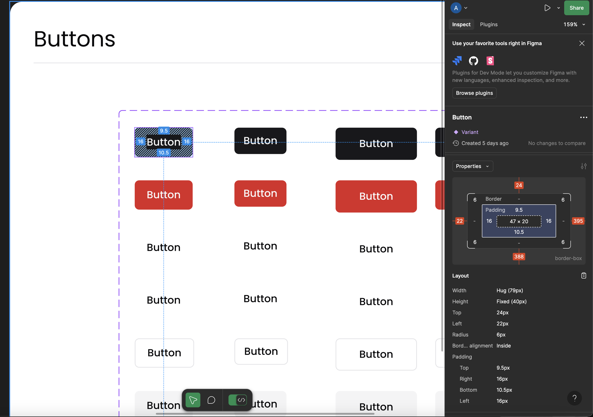
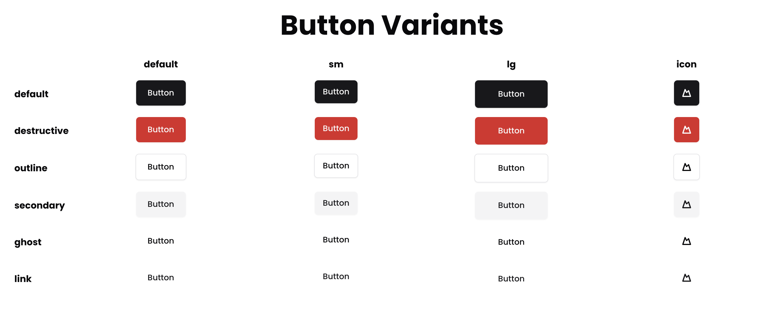

# 🚀 Starting Your First Ticket!

A go-to guide to kickstart your open source contribution journey. Follow along to get familiar with our recommended process for implementing your first UI component once you claim a ticket. Let's dive in! 🎉

## Table of Contents
- [🚀 Starting Your First Ticket!](#-starting-your-first-ticket)
- [🤔 Claimed Ticket. Now What?](#-claimed-ticket-now-what)
- [🔍 Inspecting the Design](#-inspecting-the-design)
  - [🎭 Component States](#-component-states)
  - [🎨 Visual Properties](#-visual-properties)
    - [Typography](#typography)
    - [Spacing](#spacing)
    - [Colors](#colors)
  - [🎞️ Interactive Elements](#-interactive-elements)
  - [📱 Responsive Design](#-responsive-design)
  - [♿ Accessibility](#-accessibility)
- [💻 Implementation](#-implementation)
  - [🧪 Testing](#-testing)
  - [📚 Adding Your Component to Storybook](#-adding-your-component-to-storybook)


## 🤔 Claimed Ticket. Now What?

After claiming your ticket, carefully read the description. It contains all the details you need for implementing the UI component, including a Figma link to the design. Use Figma's Dev Mode to inspect developer-specific fields and access boilerplate code.

 🔍

## 🔍 Inspecting the Design

When reviewing a design, it’s essential to consider every detail. Here’s what to look for:

### 🎭 Component States

- **Default State:** The base appearance and styling of the component. 🏠
- **Hover State:** Visual changes like color shifts, transitions, or animations when hovered. 🖱️
- **Active State:** Feedback when the component is clicked or pressed. ⚡
- **Disabled State:** The look of the component when it’s inactive or unresponsive. 🚫
- **Focus State:** Visual cues for keyboard navigation. 🎯

### 🎨 Visual Properties

#### Typography 📝
- Font family and weight
- Text size and line height
- Letter spacing
- Text alignment and wrapping

#### Spacing 📐
- Padding (inner spacing)
- Margins (outer spacing)
- Gaps between elements
- Content alignment

#### Colors 🌈
- Background colors
- Text colors
- Border colors
- Hover state colors
- Any gradients or opacity variations

### 🎞️ Interactive Elements

- **Animations:**
  - Transition timing
  - Easing functions
  - Animation duration
  - Behavior during state changes

### 📱 Responsive Design

- **Breakpoints:** How the component adapts at various screen sizes.
- **Scaling:** Adjustments in size, padding, or layout.
- **Mobile Considerations:** Optimized touch targets and spacing for mobile devices.

### ♿ Accessibility

- **Color Contrast:** Ensure compliance with WCAG guidelines.
- **Focus Indicators:** Clear visual cues for interactive elements.
- **ARIA Attributes:** Include necessary accessibility attributes.
- **Keyboard Navigation:** Proper tab order and interactive feedback.

Documenting these details will help guide your implementation and maintain consistency with the overall design system. 📝

## 💻 Implementation

With the design specifications in hand, it’s time to build your component. All UI components should be added to the `components/ui` directory.

Before you begin, check the [ShadCN Website](https://ui.shadcn.com/) to see if the component already exists. If it does, use it as your starting point. If not, create a new component. **Remember:** The core functionality of ShadCN components must remain unchanged—only the design should be updated.

You can add ShadCN components using the ShadCN CLI. For example, to add a Button component, run:

```bash
pnpm dlx shadcn@latest add button
```

This command automatically adds the component file to the `components/ui` directory. Review the implementation and then modify the design to match the Figma specifications.

### 🧪 Testing

Preview your component during development by using the `app/test` folder. Start your Next.js development server with:

```bash
pnpm run dev
```

Test and iterate until your component looks perfect! 🔧



### 📚 Adding Your Component to Storybook
